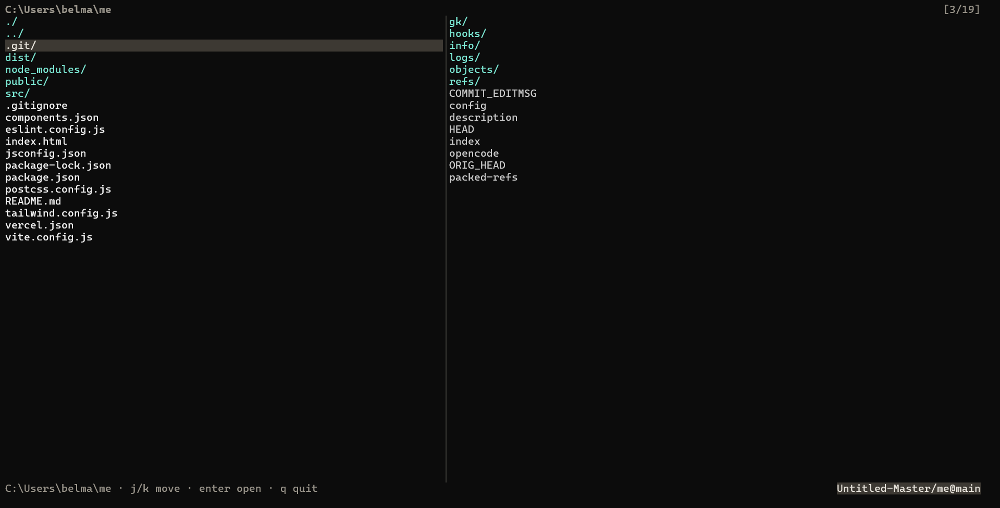
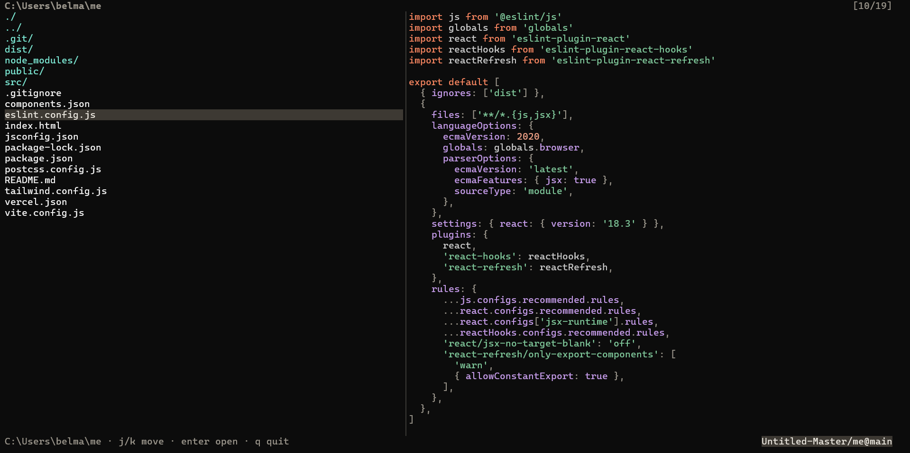
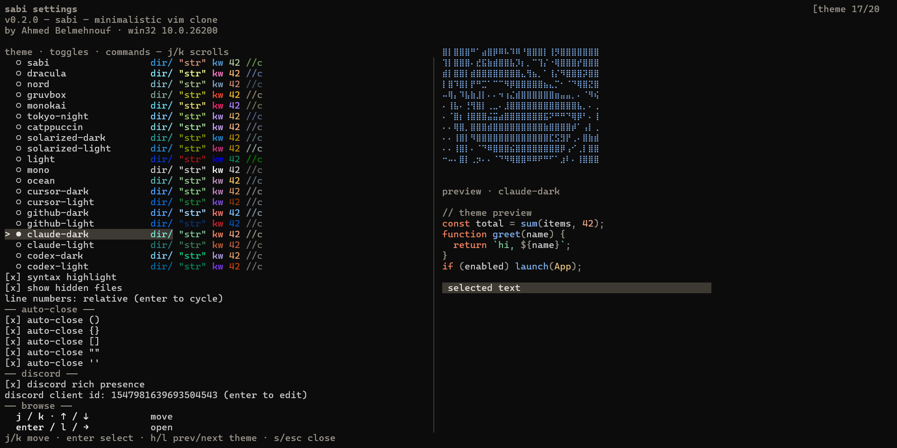
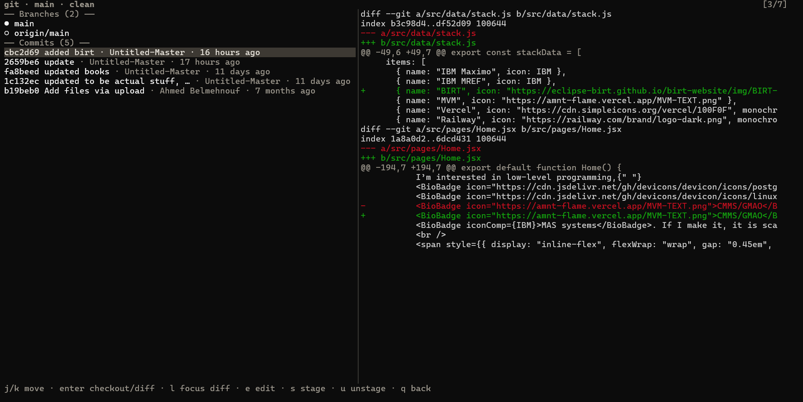

# sabi — minimal vim-like explorer/editor

Fast, zero-dependency terminal file explorer + editor. Pure Node.js stdlib, CommonJS, no build step.

## Screenshots

| Browse | Edit |
| --- | --- |
|  |  |
| *Split-pane explorer (left) + preview (right)* | *Built-in editor with syntax highlight + statusline* |

| Settings / Themes | Git view |
| --- | --- |
|  |  |
| *`s` opens theme picker with live preview, toggles, key reference* | *`ctrl-g` — branches, commits, diffs, stage/unstage* |


## Features

- Split-pane explorer: file list (left) + live preview (right)
- Built-in editor: save, undo, selection/clipboard, auto-close pairs, find in file, tabs→spaces
- Project search (`ctrl+alt+f`): skips `.git`/`node_modules`/binaries, capped at 500 matches
- Git view (`ctrl-g`): branches, commits, per-file `+/-`, diffs, checkout, stage/unstage
- 20 themes with live preview, syntax highlight toggle
- Line numbers: `off` / `normal` / `relative`
- Hidden files toggle, files-pane toggle, create file/folder, delete with confirm
- Git badge in status bar (`owner/repo@branch*`)
- Discord Rich Presence (opt-in, custom client id)
- Non-TTY fallback: pipes just list dir entries
- Editor limits: refuses >512KB, >10000 lines, or NUL-containing (binary) files

## Install

Requires Node.js 18+ (stdlib only, no deps).

```sh
git clone https://github.com/Untitled-Master/sabi-code sabi
cd sabi
# run directly
node bin/sabi.js [dir|file]

# optional: link globally
npm link
sabi [dir|file]
```

## Usage

```sh
node bin/sabi.js [dir|file]   # open dir (default: cwd)
node bin/sabi.js --list-themes
node bin/sabi.js --theme <name>
node bin/sabi.js settings     # or -s / --settings, opens settings first
SABI_CONFIG=/tmp/x.json node bin/sabi.js  # override config path (default ~/.sabi.json)
```

Piped / non-TTY just prints entries:

```sh
node bin/sabi.js | head
```

## Keybindings

### Browse

| Keys | Action |
| --- | --- |
| `j / k`, `↑ / ↓` | move |
| `enter / l / →` | open |
| `h / ← / backspace` | up a folder |
| `g / G` | first / last |
| `e` | edit file |
| `n` | new file / folder (end with `/` for folder) |
| `a / .` | hidden files |
| `s` | settings |
| `r` | reload |
| `q` | quit |
| `esc` | quit (asks first) |
| `ctrl-b` | files pane toggle |
| `ctrl-d` | delete (asks first) |
| `ctrl+alt+f` | search all files |
| `ctrl-g` | git changes |

### Edit

| Keys | Action |
| --- | --- |
| type (paste works) | insert |
| `backspace / del` | delete |
| `enter` | new line |
| `tab` | indent (2 spaces) |
| `() {} [] '' ""` | auto-close (per-pair toggle in settings) |
| `arrows` | move |
| `home / end` | line start / end |
| `pgup / pgdn` | scroll page |
| `ctrl-s` | save |
| `ctrl-a` | select all |
| `ctrl-c` | copy (whole line when no selection) |
| `ctrl-x` | cut (whole line when no selection) |
| `ctrl-v` | paste |
| `ctrl-z` | undo (100 steps) |
| `ctrl-u` | select word / grow by word |
| `ctrl-l` | select line / grow by line |
| `ctrl-f` | find in file (`enter` next, `esc` close) |
| `shift+arrows` | extend selection |
| `shift+home/end` | to line ends |
| `ctrl+shift+arrows` | extend by word / line |
| `ctrl+left/right` | jump by word |
| `ctrl+up/down` | jump half page |
| `ctrl+home/end` | top / bottom |
| `esc` | exit (twice discards unsaved) |

### Project search

| Keys | Action |
| --- | --- |
| type + `enter` | run search |
| `j / k` | move |
| `enter` | open match (jumps to exact spot) |
| `esc` | back |

### Git view

| Keys | Action |
| --- | --- |
| `j / k` | move |
| `enter / space` | checkout branch / open diff |
| `l` | focus diff |
| `e` | edit file |
| `s / u` | stage / unstage |
| `r` | reload |
| `q / esc` | back |

### Settings / dialogs

| Keys | Action |
| --- | --- |
| `j / k` | move |
| `enter / space` | select |
| `h / l` | prev / next theme |
| `s / esc` | close |
| `y / enter` → yes, `n / esc` → no | delete dialog |
| `enter` confirm, `esc` cancel | new file/folder input |

## Themes

20 built-in: `sabi`, `dracula`, `nord`, `gruvbox`, `monokai`, `tokyo-night`, `catppuccin`, `solarized-dark`, `solarized-light`, `light`, `mono`, `ocean`, `cursor-dark`, `cursor-light`, `github-dark`, `github-light`, `claude-dark`, `claude-light`, `codex-dark`, `codex-light`.

Add one: drop a file in `src/themes/` + register in `THEMES` map in `src/themes/index.js`. Must define all keys: `dir,file,link,exec,selBg,selFg,path,counter,status,divider` + `syntax: comment,str,num,kw,fn,type,bool,prop,pun` — partial themes render broken colors silently.

Syntax highlight covers: `js/ts/jsx/tsx/json`, `py`, `go`, `rust`, `c/h/cpp/java/cs/kt/swift/php/dart/scala/rb/pl`, `sh/bash/zsh/fish`, `sql`, `css/scss/less`, `html/xml/vue/svelte`, `md`, `yaml`, `toml/ini/cfg/conf`.

## Config

`~/.sabi.json` (or `$SABI_CONFIG`):

```json
{
  "theme": "sabi",
  "showHidden": true,
  "showFiles": true,
  "hl": true,
  "lineNumbers": "off",
  "autoClose": { "parens": true, "braces": true, "brackets": true, "dquote": true, "squote": true },
  "discord": { "enabled": true, "clientId": "" }
}
```

Logo on the settings page is `assets/logo.txt` (plain text, reloaded on open).

## Structure

```
bin/sabi.js      # launcher only, calls api.main()
src/
  index.js       # public API re-export only
  main.js        # CLI parsing + onKey/feedKey dispatch (browse|settings|input|edit|grep|git)
  state.js       # shared mutable singletons (state, edit)
  explorer.js / editor.js / settings.js / ui.js / create.js / grep.js / git.js
  config.js      # ~/.sabi.json load/save
  themes/ + highlight/  # theming + per-language highlighting
assets/
  logo.txt
  screenshots/   # place browse.png, edit.png, settings.png, git.png, search.png here
```

Note: `npm test` is a placeholder that always fails — do not use for verification.

## License

ISC — see `package.json` (`Ahmed Belmehnouf`).
